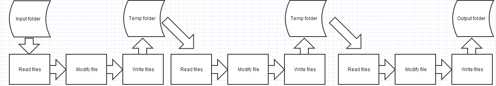

# Gulp - A Streaming Build System

### Node and Gulp
 
 IO really isn't a monolithic component of a program.  Its basically a series of tubes, and a goal for Gulp was to have a way to chain input from consumers to producers that would
 massage data as required.  This would allow the composition of large systems out of small components that do one thing well, which leads directly to the usage of libraries 
 that are abstract to institute high level flow control.
 
 Think of a series of steps to execute a build process that takes in files, modifies them and outputs new ones in a different location.
 
 
 
 Grunt was one of the early task runners, and is still widely used.  It has a significantly different view of flow control
 
  
 
 and it is very verbose and slow, because its IO is based on writing transformed data to temp files before it can be used by another component.  Other issues with Grunt include

 * Plugins 
     * Do multiple things, and not always well. (Need a banner in your concatenated files?  Use the JS minifier)
     * Do things that don't need to be plugsin - Running tests
 * Config format is a bit of a mess that tries to do everything, and is not idiomatic with the `Node Way`
 * Temp files/folders produce headaches due to bad flow control.
 
 Gulp prioritizes the following:
 
 * Build file is code, not configuration
 * Standard libraries to do things
 * Plugins follow the Unix philosophy of do one thing only, and do it well
 * Tasks occur with max concurrency
 
 
### Sample Gulp task from Gulpfile
```
gulp.task('vendor-build', 'Concatenates and minifies all third party vendor libraries to one file', () => {
    var sources = libs.npm.full.concat(libs.npm.extras); //Concatenate full source files into one array

    return gulp.src(sources, {cwd : './node_modules'})
        .pipe(debug({ //Console output to see which task is running currently
            title: 'Vendor Concatenation',
            minimal: false
        }))
        .pipe(plumber()) //Prevent pipe breaking caused by errors from plugins.  The default Node pipe() method unpipes streams on error by default.
        .pipe(sourcemaps.init()) // Include a sourcemap file
        .pipe(concat('vendors.js')) //Concatenate all third party libraries into one stream
        .pipe(sourcemaps.write('.')) //Write sourcemap stream
        .pipe(gulp.dest(paths.build.js)) //Write concatenated stream to dest location
        .pipe(rename('vendors.min.js')) //Rename stream name
        .pipe(uglify()) //Minify with error handler
        .on('error', function(err) {
            logger(err);
        })
        .pipe(gulp.dest(paths.build.js)); //Write minified stream to same dest location
});
```

### Gulp Methods

#### gulp.src()

Takes in a glob (string matching one or more files) and returns a stream that can be piped to plugins

* `js/app.js` matches the one file
* `js/*.js` matches all JS files in the `js` directory
* `js/**/*.js` matches all JS files in all child directories of `js`
* `!js/app.js` excludes app.js from matching
* `*.+(js|css)` matches all JS and CSS files in the root directory

#### gulp.watch()

Watches files for any changes, then runs (a) task(s) when changes are detected.

```
gulp.task('watch', 'Sets file watchers for project source files for re-compilation', () => {
    gulp.watch('./libs.json', ['vendor-build']);
    gulp.watch(['./src/**/*.scss'], ['sass', 'postcss']);
    gulp.watch(['./src/**/*.js', './src/app/modules/**/*.html'], ['app-build']);
});
```
 
#### pipe()
 
Allows you to chain plugins by directing the stream from an output to an input for further data modification
 
 
 